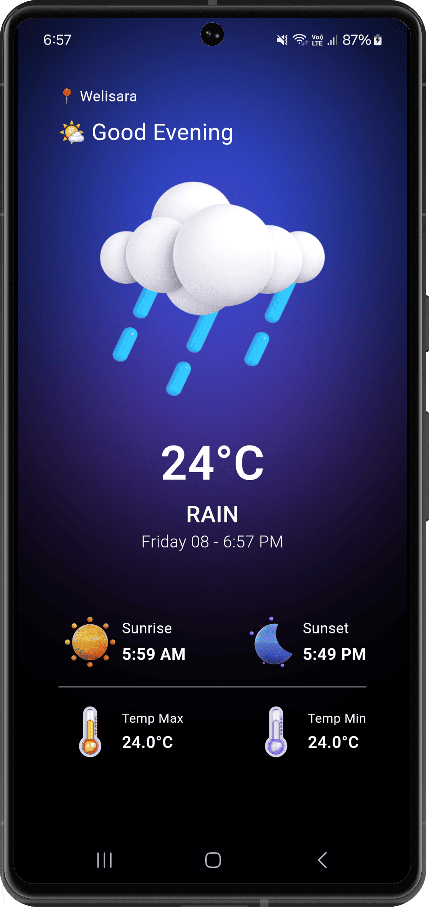
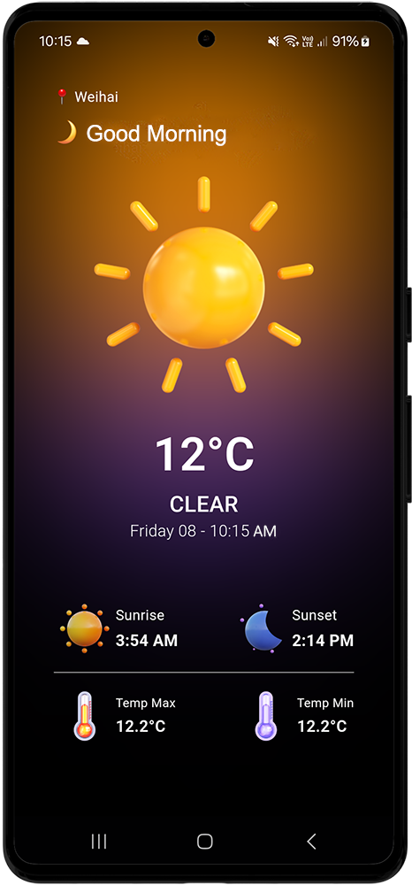

<h1 align="center" >  WeatherNow   ♨ [ Flutter  Project ] ♨</h1>

###  WeatherNow - Your Location Based Weather Companion

This Flutter app fetches live weather data based on your current location using a weather API and displays it in an intuitive interface. Stay updated on the latest weather conditions wherever you are, with features like real-time temperature, forecasts, and weather icons for a seamless experience.

## Features

- **Location-Based Weather**: Automatically fetches and displays the current weather for your location.
- **Real-Time Updates**: Provides live weather data, including temperature, humidity, and more.
- **Simple, Clean UI**: A minimalistic design for easy navigation and a better user experience.
- **Weather Forecasts**: Displays a daily forecast to help you plan ahead.
- **Weather Icons and Visuals**: Shows weather conditions with icons for easy understanding (e.g., sun, clouds, rain).
- **Unit Customization**: Allows you to switch between Celsius and Fahrenheit for temperature.

 

 

